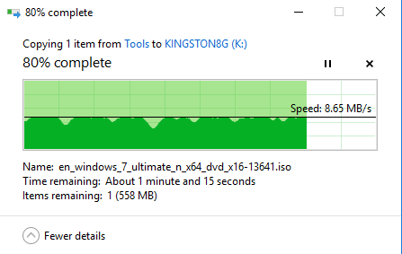

# -PS2251-50-3.23.0
群联PS2251-50量产工具 3.23.0

教程地址：https://www.upantool.com/jiaocheng/liangchan/Phison/DT_101_G2_jc.html

昨天，把Kingston DT 101 8G的U盘做了一次深度拷贝备份到另一个新的U盘，花了8个多小时（全是程序小文件），结果在80%时我不想做了，手工停了持贝，拔下了优盘，
结果Kingston DT 101 8G变成了0字节的优盘，用chipgenius找到这个U盘用的是群联PS2251-50的主控，于是在网上找了个专门针对它的量产工具，做了两次才成功地修复了。

### 测试后结果与原前没有大变化，写入速度8MB/s很稳

